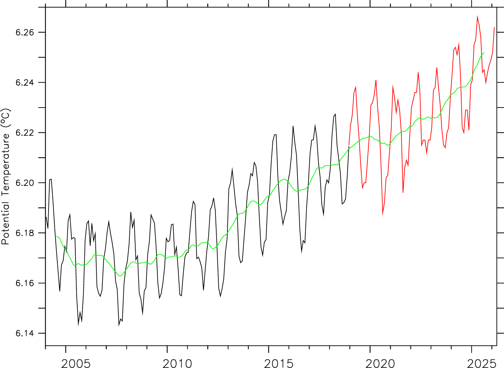

```{=html}
<style>
/* pandas/quarto dataframe tables inherit Bootstrap's .table (width:100%),
   which stretches them across the full page-layout container; size to
   content instead. */
table.dataframe { width: auto; max-width: 90%; font-size: 0.85em; margin-left: auto; margin-right: auto; }
</style>
```

```{python}
#| label: py-helpers
#| include: false

DEPTH_LABEL = {"ohc_700": "0–700 m", "ohc_2000": "0–2000 m"}
TABSET_FIGW, TABSET_FIGH = 8, 5

def _emit(md):
    print("\n" + md + "\n")

def _show_fig(fig):
    _emit('<div style="text-align:center">')
    display(fig)
    _emit("</div>")
    plt.close(fig)
```

# Goal and design

*TODO*

# Setup

This report targets the same Gulf Stream / North Atlantic Current analysis region as
`pilot_simulation.qmd`, but compares the GLORYS truth OHC field against the RG Argo
Climatology across three years (2020, 2021, 2022) rather than just one. 2020 velocity
and temperature come from `data/velocity_gs_wide/` (lat 30–48$^\circ$N); 2021 and 2022 come
from `data/velocity_gs_2021_2022/` (lat 33–45$^\circ$N, downloaded by
`code/download_gs_2021_2022.py`), a tighter latitude band over the same longitude span
and GLORYS12V1 product. Both cover the analysis region with room to spare.

```{python}
#| label: setup
#| code-summary: "Setup — imports and experiment configuration"
import sys, os
sys.path.insert(0, os.path.abspath("../code"))

import numpy as np
import pandas as pd
import xarray as xr
import matplotlib.pyplot as plt

import ohc
import ohc_bias
import ohc_climatology as ohc_clim
from trajplots import map_fields_row

YEARS = [2020, 2021, 2022]

# --- per-year velocity/temperature source and its download domain ---
VELOCITY_GLOB = {
    2020: "../data/velocity_gs_wide/velocity_2020_*.nc",
    2021: "../data/velocity_gs_2021_2022/velocity_2021_*.nc",
    2022: "../data/velocity_gs_2021_2022/velocity_2022_*.nc",
}
DOWNLOAD_BOUNDS = {  # (lat0, lat1, lon0, lon1) -- as downloaded, differs by year
    2020: (30, 48, -74, -49),
    2021: (33, 45, -74, -49),
    2022: (33, 45, -74, -49),
}

ANALYSIS_BOUNDS = (36, 40, -68, -62)     # float deployment box (4$^\circ$ lat x 6$^\circ$ lon)
CONTEXT_BOUNDS  = (34, 42, -70, -60)     # ANALYSIS_BOUNDS + 2 deg margin, inside every year's domain
EXTENT_WIDE     = [-76, -47, 28, 50]     # cartopy map extent for the wide-context maps
DEPTHS          = ["ohc_700", "ohc_2000"]   # both depth layers, shown throughout
```

# Analysis region

The analysis domain sits on the **Gulf Stream / North Atlantic Current front** — a sharp north–south OHC gradient.
The annual-mean GLORYS OHC below shows high OHC (~90 GJ m$^{-2}$) to the south and low OHC (~45 GJ m$^{-2}$) to the north, for each of 2020, 2021, and 2022.

**OHC definition.** For every 1/12$^\circ$ grid cell, OHC (GJ m$^{-2}$) is the integral $\text{OHC} = \int_0^{z} \rho\, c_p\, T\, dz$ computed using the trapezoidal rule for $z = 700$ m and $z = 2000$ m where $T$ is the sea water potential temperature in $^\circ$C reported at 50 standard depth levels (41 levels from 0m-2250m: 0.41m, 1.54m, ..., 644m, 763m, ..., 1942m, 2225m).
Unlike Levitus et al. [2012], which computed $\rho$ and $c_p$ from annual climatological T/S fields, here both are fixed constants -- adequate at this study's scope (a $4^\circ\times6^\circ$ region and a *bias* between two estimators computed the same way, so most of the T/S-dependence common to both cancels) but worth revisiting if the analysis later targets absolute OHC magnitudes or multi-year trends, where Levitus-style climatological $\rho,c_p$ would matter more.

```{python}
#| label: load-region-fields
#| code-summary: "Load per-year GLORYS velocity/temperature and compute the true OHC field"
# Cache truth_ohc_field (reads all 41 depth levels -- the dominant cost here)
# to NetCDF so re-rendering doesn't repeat it. Delete the .nc to force a recompute.
OHC_TRUTH_DIR = "../data/ohc_truth"
os.makedirs(OHC_TRUTH_DIR, exist_ok=True)

theta = {}
truth_field_full = {}
for y in YEARS:
    la0, la1, lo0, lo1 = DOWNLOAD_BOUNDS[y]
    theta[y] = xr.open_mfdataset(VELOCITY_GLOB[y]).sel(
        latitude=slice(la0, la1), longitude=slice(lo0, lo1),
    )
    cache_path = f"{OHC_TRUTH_DIR}/truth_ohc_{y}.nc"
    if os.path.exists(cache_path):
        truth_field_full[y] = xr.open_dataset(cache_path).load()
    else:
        truth_field_full[y] = ohc.truth_ohc_field(theta[y]).compute()
        truth_field_full[y].to_netcdf(cache_path)
```

```{python}
#| label: ohc-field-region-helper
#| include: false
#| code-summary: "Helper: plot the annual-mean OHC field for one year"
def plot_ohc_field_year(y):
    ohc_mean = truth_field_full[y].mean("time")
    return map_fields_row(
        [ohc_mean["ohc_700"] * ohc_bias.J_TO_GJ, ohc_mean["ohc_2000"] * ohc_bias.J_TO_GJ],
        titles=["ohc 700m", "ohc 2000m"],
        cmaps=["viridis", "viridis"], cbar_labels=["GJ m$^{{-2}}$", "GJ m$^{{-2}}$"],
        extent=EXTENT_WIDE,
        boxes=[(*DOWNLOAD_BOUNDS[y], "download domain", '0.5', "-"),
               (*ANALYSIS_BOUNDS, "analysis domain")],
        suptitle=f"GLORYS 1/12$^\circ$ {y}-mean",
    )
```

::: {.panel-tabset}

## 2020

```{python}
#| label: fig-ohc-field-2020
#| fig-cap: 'GLORYS 1/12$^\circ$ 2020-mean OHC (0–700 m and 0–2000 m)'
_ = plot_ohc_field_year(2020)
```

## 2021

```{python}
#| label: fig-ohc-field-2021
#| fig-cap: 'GLORYS 1/12$^\circ$ 2021-mean OHC (0–700 m and 0–2000 m)'
_ = plot_ohc_field_year(2021)
```

## 2022

```{python}
#| label: fig-ohc-field-2022
#| fig-cap: 'GLORYS 1/12$^\circ$ 2022-mean OHC (0–700 m and 0–2000 m)'
_ = plot_ohc_field_year(2022)
```

:::

Argo floats in this region park and drift at ~1000 m between profiling cycles.
The annual-mean `uo`/`vo` near 1000 m below shows the strong North Atlantic / Gulf Stream current a float deployed here would be advected by, for each year.

```{python}
#| label: velocity-1000-helper
#| include: false
#| code-summary: "Helper: plot the annual-mean velocity near the 1000 m parking depth for one year"
def plot_velocity_1000_year(y):
    u1000 = theta[y]["uo"].sel(depth=1000, method="nearest")
    v1000 = theta[y]["vo"].sel(depth=1000, method="nearest")
    zlev = float(u1000.depth)
    u1000, v1000 = u1000.mean("time").compute(), v1000.mean("time").compute()
    vlim = float(np.nanpercentile(
        np.abs(np.concatenate([u1000.values.ravel(), v1000.values.ravel()])), 99))
    return map_fields_row(
        [u1000, v1000],
        titles=[f"uo (eastward), ~{zlev:.0f} m", f"vo (northward), ~{zlev:.0f} m"],
        cmaps=["RdBu_r", "RdBu_r"], cbar_labels=["m s$^{-1}$", "m s$^{-1}$"],
        vmin=-vlim, vmax=vlim,
        extent=EXTENT_WIDE,
        boxes=[(*DOWNLOAD_BOUNDS[y], "download domain", '0.5', "-"),
               (*ANALYSIS_BOUNDS, "analysis domain")],
        suptitle=f"GLORYS {y}-mean velocity near the 1000 m parking depth",
    )
```

::: {.panel-tabset}

## 2020

```{python}
#| label: fig-velocity-1000-2020
#| fig-cap: "GLORYS 2020-mean horizontal velocity near the 1000 m parking depth."
_ = plot_velocity_1000_year(2020)
```

## 2021

```{python}
#| label: fig-velocity-1000-2021
#| fig-cap: "GLORYS 2021-mean horizontal velocity near the 1000 m parking depth."
_ = plot_velocity_1000_year(2021)
```

## 2022

```{python}
#| label: fig-velocity-1000-2022
#| fig-cap: "GLORYS 2022-mean horizontal velocity near the 1000 m parking depth."
_ = plot_velocity_1000_year(2022)
```

:::

# OHC Anomaly

**Climatology source.** `data/rg_climatology/RG_ArgoClim_Temperature_2019.nc` (the [RG Argo Climatology](https://sio-argo.ucsd.edu/RG_Climatology.html)) contains `ARGO_TEMPERATURE_MEAN`: a single **static** mean temperature field (Jan 2004 -- Dec 2018, no seasonal/monthly dimension) on a 1$^\circ$ lat/lon grid and 58 pressure levels (2.5--1975 dbar).
Its longitude is 0--360$^\circ$E and is converted to -180..180$^\circ$ on load.

The twelve monthly extension files `RG_ArgoClim_<YYYY><MM>_2019.nc` each contain the observed `ARGO_TEMPERATURE_ANOMALY` from the 2004--2018 mean for each calendar month. We load these for each of 2020, 2021, and 2022.

**Climatological OHC field.** Either mean-temperature field is integrated over depth with the same trapezoidal rule used for GLORYS (`ohc.profile_ohc`, treating RG's pressure in dbar as meters, the same approximation already used throughout this report), giving an `ohc_700`/`ohc_2000` field on RG's native 1$^\circ$ grid.

**Linear interpolation from 1$^\circ$ to 1/12$^\circ$.** Because the true GLORYS temperature field is on a 1/12$^\circ$ grid, `code/ohc_climatology.py` bilinearly interpolates the climatological OHC to the 1/12$^\circ$ grid for each calendar month.

**Anomaly.** For a grid cell at $x = (x_{lat}, x_{lon})$ observed in month $t$ of year $y$, the OHC anomaly is calculated by subtracting the spatially interpolated climatological OHC for that calendar month (built from **that year's** RG extension file) from the observed monthly-mean GLORYS OHC value. This is repeated independently for 2020, 2021, and 2022, each against its own year's RG climatology anomaly.

```{python}
#| label: climatology-prep
#| code-summary: "Load the RG climatology (seasonal, per year + static) and compute the truth OHC anomaly for 2020-2022"
mean_da = ohc_clim.load_rg_mean()
clim_field_B = ohc_clim.climatological_ohc_field(mean_da)  # static 2004-2018 mean

clim_field = {}       # per-year seasonal climatology (Option A), month dim 1-12
truth_field = {}      # per-year truth field restricted to the analysis region
truth_anom = {}       # per-year GLORYS truth OHC anomaly (native 1/12$^\circ$)
truth_anom_cells = {}
for y in YEARS:
    ext_da = ohc_clim.load_rg_extensions(year=y)
    clim_field[y] = ohc_clim.climatological_ohc_field(mean_da + ext_da).compute()
    truth_field[y] = truth_field_full[y].sel(
        latitude=slice(ANALYSIS_BOUNDS[0], ANALYSIS_BOUNDS[1]),
        longitude=slice(ANALYSIS_BOUNDS[2], ANALYSIS_BOUNDS[3]),
    )
    truth_anom[y] = ohc_clim.truth_ohc_anomaly(truth_field[y], clim_field[y])
    truth_anom_cells[y] = ohc_clim.to_cells_table(truth_anom[y])

# truth_field[y]'s spatial grid is identical across years (same ANALYSIS_BOUNDS
# slice of the same native 1/12 deg grid) -- only the time axis differs -- so
# concatenating along time lets downstream monthly-mean/coarsen calls run once
# on all three years instead of once per year.
truth_field_all = xr.concat([truth_field[y] for y in YEARS], dim="time")

# All three years concatenated -- one 36-month table for the multi-year maps/limits below.
truth_anom_cells_all = pd.concat(truth_anom_cells.values(), ignore_index=True)

# Publish both to data/ so nac_gp.qmd (and any other downstream report) can load
# them directly instead of re-deriving them from the raw RG climatology files.
truth_field_all.to_netcdf(f"{OHC_TRUTH_DIR}/truth_field_analysis.nc")
truth_anom_cells_all.to_csv(f"{OHC_TRUTH_DIR}/truth_anom_cells_all.csv", index=False)

# Shared diverging colour range for every *anomaly* map below, across all years.
ANOM_VLIM = {d: float(truth_anom_cells_all[d].abs().quantile(0.98)) * ohc_bias.J_TO_GJ for d in DEPTHS}
```

Below is comparison of the RG climatology published temperature trend and my recreation

{width=50%}

```{python}
#| label: fig-rg-timeseries-check
#| fig-cap: 'Verification: global-mean RG potential temperature reconstructed from mean + monthly extension anomalies. The ~0.04 $^\circ$C upward offset vs the published plot above is expected — the RG website excludes marginal seas and the Arctic from its spatial average; we include all non-NaN cells.'
#| code-summary: "Reconstruct published RG global-mean temperature time series (2004–2026)"
import matplotlib.dates as mdates
from pathlib import Path

_ds_rg  = xr.open_dataset(ohc_clim.RG_MEAN_PATH, decode_times=False)
_mean_v = _ds_rg["ARGO_TEMPERATURE_MEAN"].values    # (pres, lat, lon)
_anom_v = _ds_rg["ARGO_TEMPERATURE_ANOMALY"].values # (180, pres, lat, lon)
_p      = _ds_rg["PRESSURE"].values
_lat    = _ds_rg["LATITUDE"].values
_ds_rg.close()

_dp     = np.diff(_p)
_coslat = np.cos(np.deg2rad(_lat))

def _vol_mean_T(T):
    T_mid = (T[:-1] + T[1:]) / 2    # trapezoidal averages; NaN where either endpoint NaN
    w     = _dp[:, None, None] * _coslat[None, :, None]
    return float(np.nansum(T_mid * w) / np.nansum(np.where(np.isnan(T_mid), 0.0, w)))

_dates_main = pd.date_range("2004-01", periods=180, freq="MS")
_tmean_main = np.array([_vol_mean_T(_mean_v + _anom_v[i]) for i in range(180)])

# Load all available extension months (2019 onward)
_ext_targets = [(y, m) for y in range(2019, 2027) for m in range(1, 13)
                if not (y == 2026 and m > 2)]
_ext_dates, _ext_vals = [], []
for _y, _m in _ext_targets:
    _path = f"../data/rg_climatology/RG_ArgoClim_{_y}{_m:02d}_2019.nc"
    if not Path(_path).exists():
        continue
    _ds = xr.open_dataset(_path, decode_times=False)
    _anom = _ds["ARGO_TEMPERATURE_ANOMALY"].values.squeeze(0)
    _ext_vals.append(_vol_mean_T(_mean_v + _anom))
    _ext_dates.append(pd.Timestamp(_y, _m, 1))
    _ds.close()

# Bridge the Dec 2018 / Jan 2019 gap by prepending the last climatology point
# to the extension series so the two line segments share an endpoint.
_bridge_date = pd.Timestamp(2018, 12, 1)
_bridge_val  = _tmean_main[-1]

_all_dates = np.array([_bridge_date] + _ext_dates, dtype="datetime64[ns]")
_all_vals  = np.concatenate([[_bridge_val], _ext_vals])

_smooth  = pd.Series(
    np.concatenate([_tmean_main, _ext_vals]),
).rolling(12, center=True, min_periods=12).mean().values
_sm_dates = np.array(list(_dates_main) + _ext_dates, dtype="datetime64[ns]")
_sm_ok    = ~np.isnan(_smooth)

fig, ax = plt.subplots(figsize=(9, 4))
ax.plot(_dates_main, _tmean_main, color="black", lw=0.8, label="2004–2018 (mean + anom)")
ax.plot(_all_dates, _all_vals, color="red", lw=0.8,
        label=f"2019–{_ext_dates[-1].year} extensions")
ax.plot(_sm_dates[_sm_ok], _smooth[_sm_ok], color="limegreen", lw=1,
        label="12-month running mean")
for y in YEARS:
    ax.axvspan(pd.Timestamp(y, 1, 1), pd.Timestamp(y, 12, 31), color="#4a90d9", alpha=0.06)
ax.set_ylabel("Potential Temperature ($^\circ$C)")
ax.set_xlim(_dates_main[0], _all_dates[-1])
ax.xaxis.set_major_locator(mdates.YearLocator(2))
ax.xaxis.set_major_formatter(mdates.DateFormatter("%Y"))
ax.grid(alpha=0.2)
fig.tight_layout()
```

```{python}
#| label: fig-climatology-map-static
#| code-summary: 'RG climatology (static), native 1$^\circ$ grid vs interpolated to 1/12$^\circ$'

_clim_B_interp = ohc_clim.climatology_on_grid(
    clim_field_B, truth_field_full[2020]["latitude"].values, truth_field_full[2020]["longitude"].values
)

_STATIC_MAP_KW = dict(
    titles=["ohc 700m", "ohc 2000m"],
    cmaps=["viridis", "viridis"], cbar_labels=["GJ m$^{{-2}}$", "GJ m$^{{-2}}$"],
    extent=EXTENT_WIDE,
    boxes=[(*DOWNLOAD_BOUNDS[2020], "download domain", '0.5', "-"),
           (*ANALYSIS_BOUNDS, "analysis domain")],
)

_ = map_fields_row(
    [clim_field_B["ohc_700"] * ohc_bias.J_TO_GJ, clim_field_B["ohc_2000"] * ohc_bias.J_TO_GJ],
    suptitle="RG climatology (native 1$^\circ$)", **_STATIC_MAP_KW,
)
_ = map_fields_row(
    [_clim_B_interp["ohc_700"] * ohc_bias.J_TO_GJ, _clim_B_interp["ohc_2000"] * ohc_bias.J_TO_GJ],
    suptitle="RG climatology (bilinear -> 1/12$^\circ$)", **_STATIC_MAP_KW,
)
```

```{python}
#| label: fig-climatology-map-seasonal
#| output: asis
#| code-summary: 'RG climatology by year and month, native 1$^\circ$ grid vs interpolated to 1/12$^\circ$, the GLORYS truth, the GLORYS truth - RG climatology anomaly, and eastward/northward velocity'

# Fixed view for every panel below, regardless of its native grid resolution.
ANALYSIS_XLIM = (ANALYSIS_BOUNDS[2], ANALYSIS_BOUNDS[3])
ANALYSIS_YLIM = (ANALYSIS_BOUNDS[0], ANALYSIS_BOUNDS[1])

_clim_A_plot_years, _clim_A_interp_cells_years = [], []
for y in YEARS:
    months_y = [pd.Timestamp(y, m, 1) for m in clim_field[y]["month"].values]
    plot_y = clim_field[y].sel(
        latitude=slice(CONTEXT_BOUNDS[0], CONTEXT_BOUNDS[1]),
        longitude=slice(CONTEXT_BOUNDS[2], CONTEXT_BOUNDS[3]),
    ).assign_coords(month=months_y)
    _clim_A_plot_years.append(plot_y)
    _clim_A_interp_cells_years.append(
        ohc_clim.climatology_cells_table(
            clim_field[y], truth_field_full[2020]["latitude"].values, truth_field_full[2020]["longitude"].values,
            months=months_y,
        )
    )

# One 36-month table per map kind, across all three years.
_clim_A_native_cells = ohc_clim.to_cells_table(xr.concat(_clim_A_plot_years, dim="month"))
_clim_A_interp_cells = pd.concat(_clim_A_interp_cells_years, ignore_index=True)

# GLORYS truth, monthly-mean, same grid as the anomaly. truth_field_all already
# carries real per-year dates, so one resample over all three years gives
# correctly-dated months directly -- no per-year loop/relabeling needed.
truth_monthly_all = truth_field_all.resample(time="1MS").mean().rename({"time": "month"})
truth_monthly_cells_all = ohc_clim.to_cells_table(truth_monthly_all)

# Velocity near the 1000 m parking depth, monthly-mean, analysis region only.
# theta[y] itself can't be concatenated (different years cover different lat/lon
# extents -- see DOWNLOAD_BOUNDS), but restricting each to ANALYSIS_BOUNDS first
# gives identical grids that can be, so the resample below still runs once.
_theta_analysis_all = xr.concat(
    [
        theta[y][["uo", "vo"]].sel(depth=1000, method="nearest").sel(
            latitude=slice(ANALYSIS_BOUNDS[0], ANALYSIS_BOUNDS[1]),
            longitude=slice(ANALYSIS_BOUNDS[2], ANALYSIS_BOUNDS[3]),
        )
        for y in YEARS
    ],
    dim="time",
)
velocity_monthly_all = _theta_analysis_all.resample(time="1MS").mean().compute().rename({"time": "month"})
velocity_cells_all = ohc_clim.to_cells_table(velocity_monthly_all, value_cols=("uo", "vo"))
VEL_VLIM = float(pd.concat([velocity_cells_all["uo"], velocity_cells_all["vo"]]).abs().quantile(0.98))

# Shared absolute-OHC colour range across native/interpolated climatology and truth.
_abs_bounds = {
    d: (float(pd.concat([_clim_A_native_cells[d], truth_monthly_cells_all[d]]).mul(ohc_bias.J_TO_GJ).quantile(0.02)),
        float(pd.concat([_clim_A_native_cells[d], truth_monthly_cells_all[d]]).mul(ohc_bias.J_TO_GJ).quantile(0.98)))
    for d in DEPTHS
}

def show_clim_map(kind, d):
    cmin, cmax = _abs_bounds[d]
    common = dict(width=TABSET_FIGW, ncols=6, xlim=ANALYSIS_XLIM, ylim=ANALYSIS_YLIM)
    if kind == "native":
        return ohc_bias.plot_monthly_cell_maps(
            _clim_A_native_cells, d, vmin=cmin, vmax=cmax,
            title=f"RG climatology {d} by year/month (native 1$^\circ$)", **common)
    if kind == "interp":
        return ohc_bias.plot_monthly_cell_maps(
            _clim_A_interp_cells, d, vmin=cmin, vmax=cmax,
            title=f"RG climatology {d} by year/month (bilinear -> 1/12$^\circ$)", **common)
    if kind == "truth":
        return ohc_bias.plot_monthly_cell_maps(
            truth_monthly_cells_all, d, vmin=cmin, vmax=cmax,
            title=f"GLORYS truth {d} by year/month (native 1/12$^\circ$)", **common)
    if kind == "anom":
        return ohc_bias.plot_monthly_cell_maps(
            truth_anom_cells_all, d, vmin=-ANOM_VLIM[d], vmax=ANOM_VLIM[d], cmap="RdBu_r",
            cbar_label=f"{d} anomaly (GJ m$^{{-2}}$)",
            title=f"GLORYS truth - RG climatology (native 1/12$^\circ$)", **common)

def show_velocity_map(component):
    label = "eastward" if component == "uo" else "northward"
    return ohc_bias.plot_monthly_cell_maps(
        velocity_cells_all, component, vmin=-VEL_VLIM, vmax=VEL_VLIM, cmap="RdBu_r",
        value_scale=1, cbar_label=f"{component} (m s$^{{-1}}$)",
        title=f"GLORYS {label} velocity ({component}) ~1000 m, by year/month",
        width=TABSET_FIGW, ncols=6, xlim=ANALYSIS_XLIM, ylim=ANALYSIS_YLIM,
    )

_emit("::: {.panel-tabset}")
for d in DEPTHS:
    _emit(f"## {DEPTH_LABEL[d]}")
    _emit("::: {.panel-tabset}")
    for kind, label in [("native", "Native 1$^\circ$"), ("interp", "Interpolated to 1/12$^\circ$"),
                         ("truth", "GLORYS truth"), ("anom", "Anomaly")]:
        _emit(f"### {label}")
        _show_fig(show_clim_map(kind, d))
    _emit(":::")
_emit("## Eastward velocity")
_show_fig(show_velocity_map("uo"))
_emit("## Northward velocity")
_show_fig(show_velocity_map("vo"))
_emit(":::")
```

```{python}
#| label: fig-climatology-seasonality
#| fig-cap: "RG climatological OHC, area-mean over the analysis region, by year"

def _box_mean(field, bounds=ANALYSIS_BOUNDS, value_cols=DEPTHS):
    la0, la1, lo0, lo1 = bounds
    sub = field.sel(latitude=slice(la0, la1), longitude=slice(lo0, lo1))
    w = np.cos(np.deg2rad(sub["latitude"]))
    return sub[list(value_cols)].weighted(w).mean(dim=("latitude", "longitude"))

box_by_year = {y: _box_mean(clim_field[y]) for y in YEARS}  # dims: month (1-12), per year
box_B = _box_mean(clim_field_B)  # scalar, static 2004-2018 reference

fig, axes = plt.subplots(1, 2, figsize=(9, 4), sharex=True)
months = np.arange(1, 13)
palette = plt.get_cmap("tab10").colors
for ax, d in zip(axes, DEPTHS):
    for i, y in enumerate(YEARS):
        ax.plot(months, box_by_year[y][d] * ohc_bias.J_TO_GJ, "-o", color=palette[i], label=f"{y} mean")
    ax.axhline(float(box_B[d]) * ohc_bias.J_TO_GJ, color="0.4", ls="--", label="static 2004-2018")
    ax.set_title(f"{d} background OHC, analysis-region mean")
    ax.set_xlabel("calendar month")
    ax.set_xticks(months)
    ax.grid(alpha=0.2)
axes[0].set_ylabel("OHC (GJ m$^{-2}$)")
axes[0].legend(frameon=False, fontsize="small")
fig.tight_layout()
```
